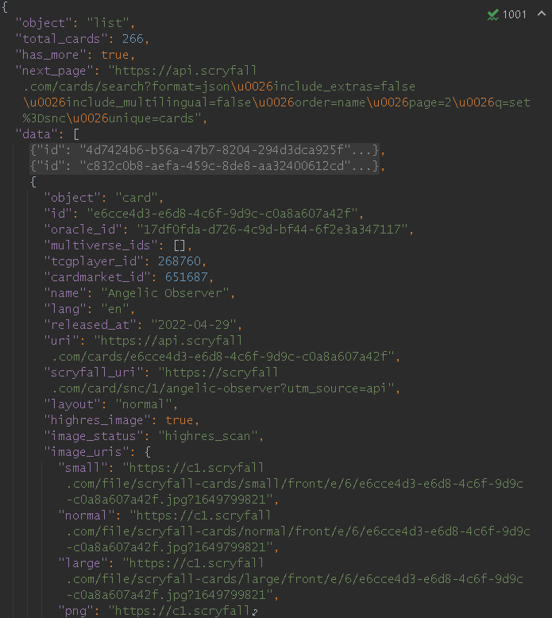

## Obtaining scryfall data
The [Scryfall search API](https://scryfall.com/docs/api/cards/search) allows 
us to retrieve up-to-date magic card text and images. Here are example 
queries you can enter into your browser search bar:

    api.scryfall.com/cards/search?q=set:snc
    api.scryfall.com/cards/search?q=set:snc&page=2

The JSON returned comes as a list with `total_cards`, `has_more`, `next_page`, 
and `data`, a list of card objects. It's up to us to extract this information 
and use it!




## Main loop in sketch.js

We could use the callback parameter in loadJSON, but loading in `preload()` 
is simpler.
```js
function preload() {
    font = loadFont('data/consola.ttf')
    scryfall = loadJSON('json/scryfall-snc.json')
}
```

Our main loop is fairly simple: we ask the passage to render itself.

```js
function draw() {
    background(234, 34, 24)
    passage.render()
}
```

 
Unfinished notes:   

    setup → 
        load sounds
        cards = getCardData() ← create list of cards with relevant info
            typeText, name, collector_number, normal_uri / art_crop_uri
            you need to figure out how to concatenate parts to make typeText
                nontrivial. how to deal with power/toughness if not a creature?
            image_uris is its own key. normal_uri is inside.
        cards.sort(sortCardsByID) ← sort by 'collector_number'
            see w3schools.com/jsref/jsref_sort.asp on sorting functions
        updateCard() ← selects a new card based on the currentCardIndex
            displays card image. creates Passage object based on its typeText

    keyPressed
        handle - → —, * → •, ENTER → \n
        calls processTypedKey()

    processTypedKey(k) ← check if typed char matches current passage char
        decide what to do if correct vs incorrect

## Typing UI in passage.js
    constructor → instance fields
        text: our passage text. in this case, it's the typeText of the card
        passageIndex: index of char we're typing in our passage
        correctList: list of boolean flags marking each char right or wrong
            used for highlightBoxes
        constants ← things like TOP_MARGIN, LINE_WRAP_X_POS

    render → shows passage
        set HIGHLIGHT_BOX_HEIGHT
        char_pos array ← position for every displayed character
            used for current word bar. maybe can be optimized to last word
        keep track of cursor
        iterate through every character of the passage:
            save cursor position in char_pos
            this.#showHighlightBox(i, cursor)
            draw current character
            this.#handleNewLines ← wrap cursor position if over LINE_WRAP_X_POS
        this.#showCurrentWordBar(char_pos)
        this.#showTextCursor(char_pos)

    #wrapCursor ← increase y, reset x
    finished()
    getCurrentChar() ← return this.text[this.index]
    setCorrect() ← this.correctList.push(true); this.advance()
    setIncorrect()
    advance() ← if !this.finished(): this.index+=1